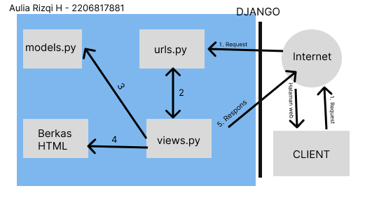

Nama : Aulia Rizqi Hidayatunnisa

Kelas : PBP B

NPM : 2206817881

Tautan aplikasi Adaptable : https://my-app-shopping-product.adaptable.app

Tautan repository : https://github.com/auliarizqiqi/shopping-product.git

TUGAS 5 - PBP

1. Jelaskan manfaat dari setiap element selector dan kapan waktu yang tepat untuk menggunakannya.
Jawab: salah satu jenis selector dalam CSS yang digunakan untuk memilih elemen HTML berdasarkan nama elemen HTML-nya. Setiap elemen HTML dapat diberikan selector dengan cara mengidentifikasi elemen tersebut menggunakan namanya. 
- class selector : untuk mengelompokkan elemen dengan karakteristik yang sama.
- ID selector : menggunakan ID pada tag sebagai selector-nya. ID bersifat unik dalam satu halaman web. ID dapat ditambahkan pada halaman template HTML.

Manfaat penggunaan element selector dan waktu yang tepat untuk menggunakannya:

- ketika ingin mengganti gaya semua elemen dengan nama tertentu dalam dokumen HTML, misal ingin mengubah gaya semua elemen 
 atau semua elemen <h1> dapat menggunakan element selector untuk melakukan perubahan ini secara konsisten di seluruh halaman web.
   
- ketika ingin menimpa gaya yang sudah ada dan memberikan gaya yang lebih spesifik dan akan menggantikan gaya yang sudah ada. Jika Anda ingin mengubah gaya elemen yang sudah memiliki definisi gaya dalam CSS lain, element selector dapat digunakan untuk memberikan gaya yang lebih spesifik dan akan menggantikan gaya yang sudah ada.

- Ketika ingin mengganti gaya pada elemen tertentu dalam konteks tertentu. Element selector dapat digunakan untuk mengubah gaya elemen tertentu dalam konteks tertentu. Misalnya, jika ingin mengubah gaya elemen 
 hanya dalam div dengan class tertentu, dapat menggunakan kombinasi element selector dengan class selector atau ID selector.

2. Jelaskan HTML5 Tag yang kamu ketahui.
Jawab: Tag adalah suatu tanda pengenal dokumen pada html yang terdiri 2 bagian yaitu tag pembuka contoh <nama_tag> dan tag penutup contoh </nama_tag>, tanda "/" pada tag penutup menandakan bahwa sifat yang dibawa oleh tanda pengenal berakhir. Namun ada beberapa Tag yang berdiri sendiri diantaranya :  , 
, . Tag - tag ini bersifat unik karena tag ini tidak perlu menggunakan tag penutup.

Contoh tag:
- <html> adalah tag untuk membuat sebuah dokumen baru
- <title> adalah tag untuk membuat judul dari sebuah halaman
- <body> adalah tag untuk membuar body/tubuh dari sebuah halaman
- 
 adalah tag untuk membuat paragraf
- <button> adalah tag untuk membuat sebuah tombol yang dapat diklik

sumber: https://codepolitan.com/blog/pengenalan-html5-belajar-html

https://gilacoding.com/read/tag-tag-pada-html-beserta-fungsinya

3. Jelaskan perbedaan antara margin dan padding.
Jawab: Margin: mengosongkan area di sekitar border (transparan), sedangkan Padding: mengosongkan area di sekitar konten (transparan).
Dalam CSS, margin adalah ruang di sekitar batas elemen, sedangkan padding adalah ruang antara batas elemen dan konten elemen. Dengan kata lain, properti margin mengontrol ruang di luar elemen, dan properti padding mengontrol ruang di dalam elemen.
Kegunaan margin:
- mengubah posisi elemen pada halaman
- atur jarak antar elemen terdekat
- menginginkan elemen yang tumpang tindih

Kegunaan padding;
- menambahkan spasi antara content dan border
- mengubah ukuran element

sumber: https://blog.hubspot.com/website/css-margin-vs-padding

4. Jelaskan perbedaan antara framework CSS Tailwind dan Bootstrap. Kapan sebaiknya kita menggunakan Bootstrap daripada Tailwind, dan sebaliknya?
Jawab: Perbedaan framework CSS Tailwind dan Bootstrap dari berbagai aspek:
- Desain
Bootstrap sering kali menghasilkan tampilan yang lebih konsisten di seluruh proyek karena menggunakan komponen yang telah didefinisikan.Sedangkan tailwind memberikan fleksibilitas dan adaptabilitas tinggi terhadap proyek

- Fleksibilitas
Bootstrap menggunakan gaya dan komponen yang telah didefinisikan, yang memiliki tampilan yang sudah jadi dan dapat digunakan secara langsung. Sedangkan tailwind membangun tampilan dengan menggabungkan kelas-kelas utilitas yang telah didefinisikan sebelumnya.

- Ukuran File
Bootstrap memiliki file CSS yang lebih besar dibandingkan dengan Tailwind CSS karena termasuk banyak komponen yang telah didefinisikan. Sedangkan tailwind CSS memiliki file CSS yang lebih kecil sedikit dibandingkan Bootstrap dan hanya akan memuat kelas-kelas utilitas yang ada.

- Pembelajaran
Bootstrap memiliki pembelajaran yang lebih cepat untuk pemula karena dapat mulai dengan komponen yang telah didefinisikan. Sedangkan tailwind CSS memiliki pembelajaran yang lebih curam karena memerlukan pemahaman terhadap kelas-kelas utilitas yang tersedia dan bagaimana menggabungkannya untuk mencapai tampilan yang diinginkan.

Sebaiknya kita menggunakan Bootstrap daripada Tailwind ketika kita ingin membuat proyek dengan desain tradisional yang membutuhkan kerangka kerja yang stabil dan mudah digunakan, memerlukan fitur dan komponen yang siap pakai, dan direkomendasikan untuk pemula karena dapat mulai dengan komponen yang telah didefinisikan. 
Namun, sebaiknya kita menggunakan Tailwind daripada Bootstrap ketika kita ingin menggunakan class yang sangat spesifik, dan memberikan kebebasan kreatif, serta membutuhkan ukuran file yang lebih ringan dan ketika kita menggunakan banyak class utilitas dalam kode, ukuran file CSS dapat meningkat.

sumber: tutorial 4 PBP

https://codepolitan.com/blog/perbedaan-bootstrap-dan-tailwind

5. Jelaskan bagaimana cara kamu mengimplementasikan checklist di atas secara step-by-step (bukan hanya sekadar mengikuti tutorial).
Jawab:
-  Kustomisasi desain pada templat HTML yang telah dibuat pada Tugas 4 dengan menggunakan CSS atau CSS framework (seperti Bootstrap, Tailwind, Bulma) dengan ketentuan sebagai berikut: 
    -  Kustomisasi halaman login, register, dan tambah inventori semenarik mungkin.
    - Kustomisasi halaman daftar inventori menjadi lebih berwarna maupun menggunakan apporach lain seperti menggunakan Card.

Saya menambahkan inventori berupa size atau ukuran dari produk tersebut menggunakan charField. Kustomisasi halaman login dan register dengan memberikan warna dan mengubah letak bar login agar berada di tengah dengan menambahkan potongan kode di file main.html
Saya juga menggunakan card yang sumbernya saya peroleh dari https://getbootstrap.com/docs/5.3/components/card/ menggunakan bootstrap pada halaman main.html 
Kemudian saya menambahkan fitur edit pada aplikasi dengan membuat fungsi baru bernama edit_product di file views.py yang ada pada subdeirektori main yang menerima parameter request dan id. Lalu membuat berkas html baru dengan nama edit_product.html pada subdirektori main/templates. Isi berkas tersebut dengan template potongan kode. Buka urls.py yang berada pada direktori main dan import fungsi edit_product yang sudah dibuat. Tambahkan path url ke dalam urlpatterns untuk mengakses fungsi yang sudah diimpor tadi. Buka main.html yang berada pada subdirektori main/templates. Tambahkan potongan kode berikut sejajar dengan elemen <td> terakhir agar terlihat tombol edit pada setiap baris tabel.

Kemudian saya membuat fungsi untuk menghapus data produk dengan membuat fungsi baru dengan nama delete_product yang menerima parameter request dan id pada views.py di folder main untuk menghapus data produk. Buka urls.py yang ada pada folder main dan impor fungsi yang sudah dibuat tadi. Tambahkan path url ke dalam urlpatterns untuk mengakses fungsi yang sudah diimpor. Bukalah berkas main.html yang ada pada folder main/templates dan ubahlah kode yang sudah ada menjadi seperti berikut agar terdapat tombol hapus untuk setiap produk.

- Menjawab beberapa pertanyaan berikut pada README.md pada root folder (silakan modifikasi README.md yang telah kamu buat sebelumnya; tambahkan subjudul untuk setiap tugas).
Menjawab semua pertanyaan di README.md, saya berikan keterangan setiap jawaban merupakan tugas ke berapa. 

- Melakukan add-commit-push ke GitHub.
Buka terminal dan masukkan perintah berikut untuk melakukan push ke Github:
git add .
git commit -m "tugas 5 selesai"
git push -u origin master

TUGAS 4 - PBP
1. Apa itu Django UserCreationForm, dan jelaskan apa kelebihan dan kekurangannya?
Jawab: UserCreationForm adalah impor formulir bawaan yang memudahkan pembuatan formulir pendaftaran pengguna dalam aplikasi web. Dengan formulir ini, pengguna baru dapat mendaftar dengan mudah di situs web Anda tanpa harus menulis kode dari awal.

Kelebihan: 
- Tidak perlu mendefinisikan form pendaftaran dari awal sehingga dapat mempercepat proses pengembangan aplikasi
- Form ini sudah memiliki validasi bawaaan untuk field-field yang ada, seperti memeriksa apakah nama user sudah atau belum

Kekurangan:
- Perlu membuat form custom sendiri jika ingin memberi field tambahan walaupun sudah disediakan form untuk kebutuhan dasar
- Hanya menangani pendaftaran user, jika ingin fitur lain seperti konfirmasi email harus menambahkannya sendiri

2. Apa perbedaan antara autentikasi dan otorisasi dalam konteks Django, dan mengapa keduanya penting?
Jawab:
- Autentikasi adalah proses verifikasi identitas pengguna. Dalam aplikasi web, hal ini biasanya melibatkan pemeriksaan kredensial pengguna (misalnya, nama pengguna dan kata sandi) terhadap database pengguna terdaftar. Jika kredensial yang diberikan cocok dengan pengguna di database, pengguna tersebut dianggap diautentikasi. Sistem autentikasi bawaan Django menyediakan kerangka kerja yang kuat dan fleksibel untuk mengelola otentikasi pengguna. Ini mencakup Usermodel untuk menyimpan informasi pengguna, serta tampilan dan formulir untuk menangani registrasi pengguna, login, dan manajemen kata sandi. Autentikasi penting untuk membedakan atau memastikan apakah user tersebut sama atau tidak dan memmastikan informasi sensitif hanya dapat diakses oleh user yang sah.

- Otorisasi adalah proses menentukan apa yang diperbolehkan user melakukan sesuatu ketika mereka berhasil diotentikasi. Setelah pengguna diautentikasi, langkah selanjutnya adalah menentukan apa yang boleh mereka lakukan dalam aplikasi. Proses ini dikenal sebagai otorisasi. Otorisasi biasanya didasarkan pada peran pengguna, grup, atau izin yang menentukan tindakan apa yang dapat dilakukan pengguna. Sistem otorisasi Django dibangun di atas sistem autentikasinya dan memungkinkan pengembang untuk mengontrol akses ke berbagai bagian aplikasi dengan mudah. Django menyediakan satu set izin default untuk model bawaannya (misalnya, menambah, mengubah, menghapus) dan mengizinkan pengembang untuk membuat izin khusus untuk model mereka sendiri.Dalam django menyediakan sistem otorisasi melalui model Permission dan sistem Group. Tanpa otorisasi semua user memungkinkan memiliki akses ke dalam semua bagian pada aplikasi sehingga dapat menimbulkan resiko keamanan dan privasi.

sumber: https://vegibit.com/understanding-djangos-authentication-and-authorization-system/

3. Apa itu cookies dalam konteks aplikasi web, dan bagaimana Django menggunakan cookies untuk mengelola data sesi pengguna?
Jawab: Cookies adalah potongan kecil data yang dikirim dari server ke browser user dan disimpan di sisi klien. Ketika browser mengakses server yang sama di masa depan, browser akan mengirim kembali cookie ini ke server.
Django menggunakan cookies untuk mengimplementasikan pengelolaan sesi secara default yang digunakan untuk mengelola sesi pengguna ddengan cara mengidentifikasi pengguna mengakses situs web, lalu server akan mengambil Session ID yang disimpan dalam cookie. Dengan cara ini, server dapat mengidentifikasi pengguna ketika membuat permintaan selanjutnya. Pada permintaan berikutnya, situs web mengirimkan cookie Session ID ke server. Django kemudian menggunakan cookie ini untuk mengambil data sesi dan membuatnya dapat diakses dalam kode. 

sumber: https://betterprogramming.pub/managing-sessions-in-django-92ef72db4c63

4. Apakah penggunaan cookies aman secara default dalam pengembangan web, atau apakah ada risiko potensial yang harus diwaspadai?
Jawab: Cookies yang digunakan dengan benar dan sesuai maka akan aman. Cookies dibuat untuk menyimpan data kecil di browser dan mengirimkannya kembali ke server web. Data yang disimpan dalam cookies tidak dapat diakses oleh pihak ketiga jika dienkripsi atau diberi sandi. Risiko potensial yang harus diwaspadai adalah jika cookies mengandung informasi sensitif seperti data pribadi, oleh karena itu penting untuk memastikan tidak ada informasi sensitif yang tidak dienkripsi. 

5. Jelaskan bagaimana cara kamu mengimplementasikan checklist di atas secara step-by-step (bukan hanya sekadar mengikuti tutorial).
Jawab: 

Checklist untuk tugas ini adalah sebagai berikut:

- Mengimplementasikan fungsi registrasi, login, dan logout untuk memungkinkan pengguna untuk mengakses aplikasi sebelumnya dengan lancar.
Jalankan virtual environment terlebih dahulu, lalu buka voews.py untuk membuat fungsi register yang menerima parameter request. Tambahkan beberapa import pada bagian paling atas termasuk import UserCreationForm untuk memudahkan pembuatan formulir. Tambahkan potongan kode ke dalam fungsi register, import fungsi yang dibuat, dan tambahkan path url. Lalu untuk membuat fungsi login buka views.py dan buat fungsi yang menerima parameteer request. Tambahkan import authenticate dan login pada bagian paling atas. Lalu tambahkan potongan kode ke dalam fungsi login untuk mengauntentikasi user yang ingin login, buat berkash HTML yang diisi dengan template untuk tampilan meminta user log in. Import fungsi yang sudah dibuat dan tambahkan path url untuk mengakses fungsi yang sudah diimpor. Kemudian untuk membuat fungsi logout buka views.py dan buatlah fungsi yang menerima parameter request, tambahkan import logout pada bagian paling atas, tambahkan potongan kode ke dalam fungsi logout yang sudah dibuat untuk melakukan mekanisme logout. Tambahkan potongan kode di dalam berkas main.html yang ada pada folder main/templates (setelah hyperlink tag). Lalu buka urls.py dan impor fungsi yang dibuat dan tambahkan path url ke dalam urlpatterns untuk mengakses fungsi yang sudah diimpor.

- Membuat dua akun pengguna dengan masing-masing tiga dummy data menggunakan model yang telah dibuat pada aplikasi sebelumnya untuk setiap akun di lokal.
Buat dua akun user, pada tugas ini misalnya saya membuat akun dengan username "kiki" dan "auliarizqi" dengan tiga dummy data untuk setiap akun dengan menambahkan add product

- Menghubungkan model Item dengan User.
Buka models.py yang ada pada subdirektori main dan tambahkan kode untuk mengimpor model. Pada model Product yang sudah dibuat, tambahkan potongan kode untuk menghubungkan satu produk dengan satu user melalui sebuah relationship, dimana sebuah produk pasti terasosiasikan dengan seorang user. Buka views.py yang ada pada subdirektori main, dan ubah potongan kode pada fungsi create_product. Ubah fungsi show_maim agar dapat menampilkan objek Product yang terasosiasikan dengan pengguna yang sedang login. Simpan semua perubahan dan lakukan migrasi model dan lakukan python manage.py migrate untuk mengaplikasikan migrasi yang dilakukan pada poin sebelumnya.

- Menampilkan detail informasi pengguna yang sedang logged in seperti username dan menerapkan cookies seperti last login pada halaman utama aplikasi.
Menerapkan cookies untuk last login untuk menyimpan informasi seperti waktu last login user dengan mengubah fungsi logout_user menjadi potongan kode yang sesuai dan mengandung kode response.delete_cookie('last_login') yang berfungsi untuk menghapus cookie last_login saat pengguna melakukan logout. Buka berkas main.html dan tambahkan potongan kode di antara tabel dan tombol logout untuk menampilkan data last login. Untuk dapat melihat data cookies last_login, dapat mengakses fitur inspect elemen dan membuka bagian Application/Storage. Lalu klik bagian cookies dan dapat lihat data cookies yang tersedia. Selain last_login, kita juga dapat melihat data sessionid dan csrftoken. Jika kita melakukan logout dan membuka riwayat cookie, maka cookie yang telah dibuat sebelumnya akan hilang dan dibuat ulang ketika kita login kembali.

- Menjawab beberapa pertanyaan berikut pada README.md pada root folder (silakan modifikasi README.md yang telah kamu buat sebelumnya; tambahkan subjudul untuk setiap tugas).

- Melakukan add-commit-push ke GitHub.
Lakukan addd-commit-push ke Github dengan cara:
git add .
git commit -m "ini pesan commit"
git push -u origin master

TUGAS 3 - PBP

1. Apa perbedaan antara form POST dan form GET dalam Django?
Jawab: form POST adalah metode untuk mengirim data dari browser ke server menggunakan metode HTTP POST. Form GET adalah metode untuk mengirim data dari browser ke server menggunakan metode HTTP GET. Terdapat perbedaan antara keduanya, yaitu:

- Data yang dikirimkan dengan metode GET akan terlihat di URL sehingga tidak cocok untuk data sensitif seperti kata sandi atau informasi pribadi. Sedangkan metode POST lebih aman untuk mengirim data sensitif karena data tersebut tidak terlihat di URL

- Metode GET biasanya digunakan ketika ingin mengambil data dari server tanpa mengubah data tersebut. Sedangkan metode POST digunakan ketika kita ingin mengirim data ke server untuk membuat, memperbaru, atau menghapus data. 

- Metode POST tidak dibatasi panjang string, sedangkan metode GET dibatasi panjang string

- Data yang dikirim dengan metode POST tidak tersimpan dalam riwayat penelusuran oleh browser, sedangkan metode GET dapat menyimpan data yang dikirim dalam riwayat penelusuran.

2. Apa perbedaan utama antara XML, JSON, dan HTML dalam konteks pengiriman data?
Jawab: 
- HTML atau HyperText Markup Language merupakan sebuah markup language yang berfokus pada penyajian data dalam bentuk halaman web dan tidak digunakan secara umum untuk pertukaran data.
- XML atau Extensible Markup Language merupakan suatu markup language yang menyimpan data dalam format teks dan tag sederhana. Digunakan untuk pertukaran data antara berbagai sistem yang memiliki struktur data yang berbeda.
- JSON atau JavaScript Object Notation merupakan suatu format yang dibuat di atas JavaScript untuk merepresentasikan data dalam bentuk key dan value. Cocok untuk pertukaran data antara server dan klien web.

3. Mengapa JSON sering digunakan dalam pertukaran data antara aplikasi web modern?
Jawab: Karena JSON merupakan format pertukaran data yang sangat ringan serta lebih mudah dibaca dan ditulis oleh manusia, sehingga mudah untuk diterjemahkan dan dibuat (generate) oleh komputer.

4. Jelaskan bagaimana cara kamu mengimplementasikan checklist di atas secara step-by-step (bukan hanya sekadar mengikuti tutorial).
Jawab: 

- Membuat input form untuk menambahkan objek model pada app sebelumnya
Membuat berkas baru pada direktori main dengan nama forms.py dan menambahkan kode ke dalam berkas tersebut. Buka berkas views.py yang ada pada folder main dan menambahkan beberapa import. Lalu membuat fungsi baru pada berkas tersebut yang menerima parameter request dan menambahkan kode untuk menghasilkan formulir yang dapat menambahkan data produk secara otomatis ketika data di-submit dari form. Kemudian mengubah fungsi show_main dengan menambahkan kode, import fungsi create-product di urls.py, dan menambahkan path url. Lalu membuat berkas HTML baru pada direktori main/templates isi dengan beberapa kode, buka main.html dan tambahkan kode untuk menampilkan data produk dalam bentuk tabel serta tombol yang akan redirect ke halaman form.

- Menambahkan 5 Fungsi Views
Membuat view baru dalam django untuk melihat objek yang sudah ditambahkan dalam berbagai format seperti HTML, XML, JSON, XML by ID, dan JSON by ID. Tambahkan fungsi dan path url untuk membuat view baru di urls.py

-  Membuat routing URL untuk masing-masing views yang telah ditambahkan pada poin 2
Konfigurasikan URL routing di Django untuk setiap view yang telah dibuat dengan import modul-modul yang diperlukan dan desfinisikan pola URL di dalam berkas urls.py

- Menjawab beberapa pertanyaan berikut pada README.md pada root folder.
Buka berkas README.md pada direktori lokal dan jawab pertanyaan-pertanyaan di berkas tersebut.

- Mengakses kelima URL di poin 2 menggunakan Postman, membuat screenshot dari hasil akses URL pada Postman, dan menambahkannya ke dalam README.md.

Gambar Postman - HTML 

Gambar Postman - XML

Gambar Postman - XML by ID 1

Gambar Postman - XML by ID 2

Gambar Postman - XML by ID 3

Gambar Postman - XML by ID 4

Gambar Postman - JSON 

Gambar Postman - JSON by ID 1

Gambar Postman - JSON by ID 2

Gambar Postman - JSON by ID 3

Gambar Postman - JSON by ID 4

- Melakukan add-commit-push ke GitHub.
Tambahkan semua perubahan ke repositori Github menggunakan perintah git add, git commit, dan git push. Pastikan projek di Github sudah terupdate.

TUGAS 2 

1. Jelaskan bagaimana cara kamu mengimplementasikan checklist di atas secara step-by-step (bukan hanya sekadar mengikuti tutorial).

Jawab:
- Membuat Proyek Django baru:

Setelah membuat repository baru di github dan menjalankan proses konfigurasi dan sebagainya, selanjutnya untuk membuat proyek django yang baru adalah dengan membuka terminal atau command prompt dan buat proyek Django baru dengan perintah: django-admin startproject namaprojek.

- Membuat Aplikasi dengan nama 'main':

Untuk membuat aplikasi main, buka terminal dan masuk ke direktori proyek Django yang baru dibuat.
Lalu jalankan terminal dengan perintah: python manage.py startapp main, lalu mendaftarkan aplikasi main ke dalam proyek pada berkas settings.py

- Melakukan Routing pada proyek:

Membuat berkas urls.py dalam proyek Django dan tambahkan routing untuk aplikasi 'main'dengan menambahkan beberapa kode pada berkas urls.py
Pastikan telah menghubungkan URL dengan tampilan main dengan mengimpor fungsi include dari django.urls

- Membuat Model dengan nama 'Item':

Membuka berkas models.py dalam aplikasi 'main' lalu buat model item dengan atribut yang sesuai dengan permintaan checklist, seperti name, amount, description. Isi berkas tersebut dengan kode untuk mengimpor models dari django.db. Seetelah itu, membuat dan mengaplikasikan migrasi model dengan menjalankan perintah python manage.py makemigrations dan python manage.py migrate.

- Membuat Fungsi pada 'views.py':

Buka berkas views.py dalam berkas aplikasi 'main' dan menambahkan baris-baris impor from django.shortcuts import render di bagian paling atas berkas untuk mengintegrasikan komponen MVT. Lalu tambahkan fungsi show_main di bawah impor untuk mengatur permintaan HTTP dan mengembalikan tampilan yang sesuai.

- Membuat sebuah Routing Aplikasi 'main':

Buat berkas urls.py dalam direktori 'main'dan isi dengan barisan kode yang sesuai. Tambahkan rute url untuk mengarahkan ke tampilan main di dalam variabel urlpatterns.
Lalu jalankan proyek Django dengan perintah python manage.py runserver. Buka website loca;host di browser untuk melihat halaman yang sudah dibuat.

- Deployment ke Adaptable:

Login pada akun Adaptable dan klik tombol New App untuk membuat aplikasi. Lalu hubungkan dengan repository pada github yang akan digunakan, pilih template deployment, dan pilih tipe baris data yang akan digunakan. Sesuaikan versi python, masukkan perintah pada bagian start command, dan masukkan nama aplikasi yang akan menjadi nama domain situs web aplikasi. Kemudian klik Deploy App untuk memulai proses deployment aplikasi.

- Membuat README.md:

Buat berkas README.md yang berisi tautan menuju aplikasi yang telah di-deploy ke Adaptable.
Jawab pertanyaan-pertanyaan yang tercantum dalam checklist dengan jelas.

2. Buatlah bagan yang berisi request client ke web aplikasi berbasis Django beserta responnya dan jelaskan pada bagan tersebut kaitan antara urls.py, views.py, models.py, dan berkas html.

Jawab: 

3. Jelaskan mengapa kita menggunakan virtual environment? Apakah kita tetap dapat membuat aplikasi web berbasis Django tanpa menggunakan virtual environment?

Jawab: Virtual environment berguna untuk mengisolasi package serta dependencies dari aplikasi sehingga tidak bertabrakan dengan versi lain yang ada pada komputer. Virtual environment ini juga berguna untuk memastikan kalau versi dari sebuah library yang digunakan di satu project tidak akan berubah apabila kita melakukan sebuah update di library yang sama di project lain-nya. Tanpa virtual environment, mungkin ada kesulitan dalam mengelola dependensi proyek yang berbeda.

4. Jelaskan apakah itu MVC, MVT, MVVM dan perbedaan dari ketiganya.

Jawab: MVT adalah singkatan dari Model-View-Template. MVT adalah sebuah konsep arsitektur yang digunakan dalam pengembangan web untuk memisahkan komponen-komponen utama dari sebuah aplikasi. Konsep ini memungkinkan pengembang web untuk mengorganisasi dan mengelola kode dengan lebih terstruktur.

MVC adalah singkatan dari Model-View-Controller yaitu pola desain yang memisahkan aplikasi menjadi tiga komponen utama: Model (logika bisnis dan data), View (tampilan yang diperlihatkan kepada pengguna), dan Controller (menerima input dari pengguna dan mengirimkannya ke Model atau View).

MVVM adalah singkatan dari Model-View-ViewModel yaitu pola desain yang sering digunakan dalam pengembangan aplikasi berbasis antarmuka pengguna (UI). Model mengurus data, View adalah tampilan yang diperlihatkan kepada pengguna, dan ViewModel adalah perantara antara Model dan View yang mengatur tampilan dan pembaruan data.

Perbedaan utama antara MVC (Model-View-Controller), MVT (Model-View-Template), dan MVVM (Model-View-ViewModel) adalah dalam cara mereka mengatur dan mengelola komponen-komponen inti dalam pengembangan perangkat lunak. MVC memisahkan aplikasi menjadi Model (logika bisnis), View (tampilan), dan Controller (pengendali) dengan pengendali yang menghubungkan Model dan View. MVT, yang umumnya digunakan dalam kerangka kerja web Django, memisahkan Model (data), View (logika tampilan), dan Template (tampilan) dengan Template sebagai pengganti Controller. Sedangkan MVVM, yang sering digunakan dalam pengembangan aplikasi berbasis antarmuka pengguna (UI), memisahkan Model (data), View (tampilan), dan ViewModel (logika tampilan) dengan ViewModel berperan sebagai perantara antara Model dan View.

